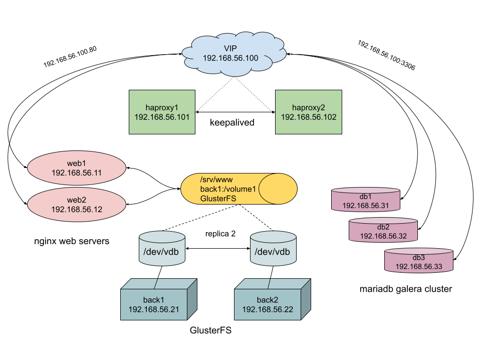
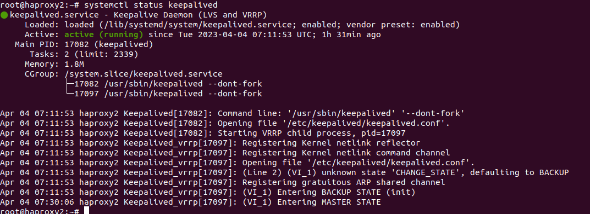
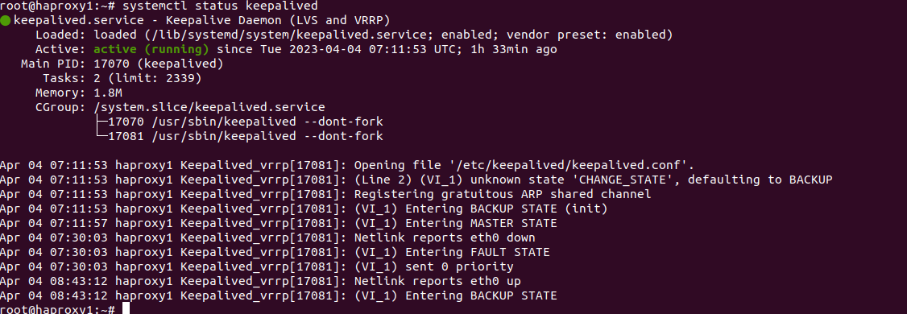
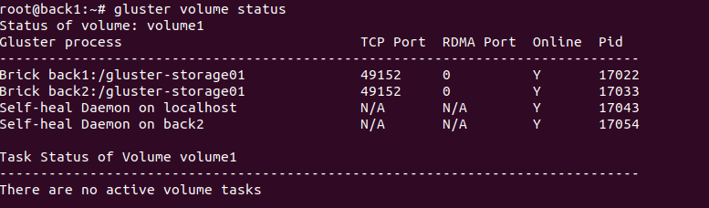
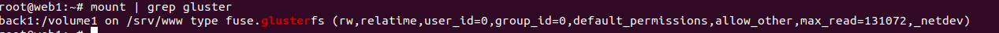
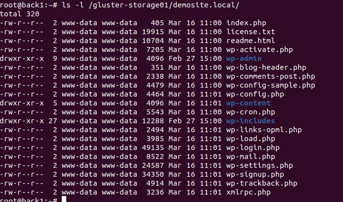
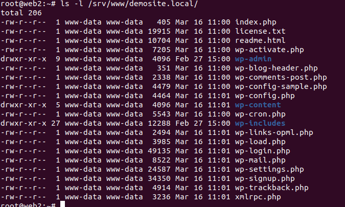
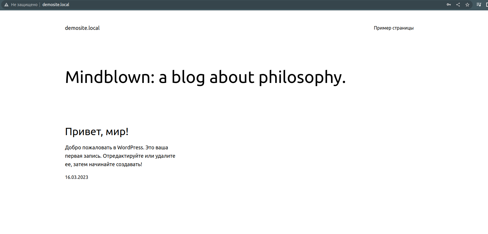

## Этот проект разворачивает 9 виртуальных машин ubuntu-server 20.04 на PVE.
- Кластер балансировщиков из 2х нод: 2 виртуальных машины с балансировщиком haproxy.
- Кластер stateless веб серверов: 2 виртуальных машины с веб серверами nginx, которые хранят статический контент на распределенной файловой системе GlusterFS.
- Кластер backend: 2 виртуальных машины для бэкэнда, на которых установлен GlusterFS.
- Кластер баз данных: 3 виртуальных машины с Mariadb-server, объединенных в кластер Galera. 

# Почему я выбрал PVE? Почти все демостэнды мы в нашей компании разворачиваем на PVE. Максимально приближенная к реальным железным условиям система реализации. Хотелось попробовать keepalived в качестве отказоустойчивости на сетевом уровне.

## Общая схема работы:

## Подробные сведения о работе того или иного компонента:

- [GlusterFS](https://github.com/misha-kuks/diplom/blob/main/roles/glusterfs-server/README.md) 
- [Galera](https://github.com/misha-kuks/diplom/blob/main/roles/mysql/README.md)  
- [HAproxy](https://github.com/misha-kuks/diplom/blob/main/roles/haproxy/README.md) 
- [Nginx](https://github.com/misha-kuks/diplom/blob/main/roles/nginx/README.md) 

## Создайте terraform.tfvars файл содержащий следующие переменные:
- pve_ip_address = "IPv4" 
- pm_user = "root@pam" 
- pm_password = "PASS" 
- proxmox_host = "HOSTNAME" 
- template = "ubuntu-focal64 or you template" 
- storage = "YOUR STORAGE"

## Для запуска развертываения запустите:
1. terraform apply
2. ansible-playbook site.yml

## Check keepalived on haproxy2 after down haproxy1:

### haproxy2:

### haproxy1:

### Check glusterfs volume on backends nodes:

## Check glusterfs client on web servers:

### web1:

### web2:

## Check content of /srv/www/demosite.local

## Check http://demosite.local

