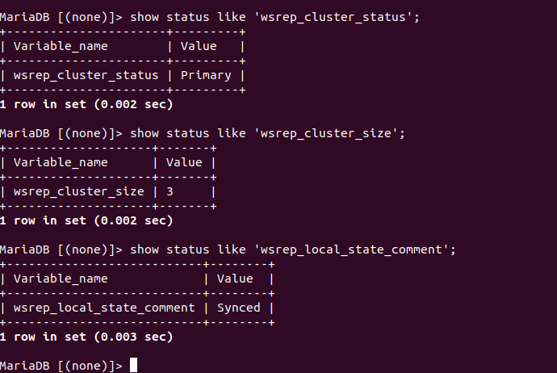
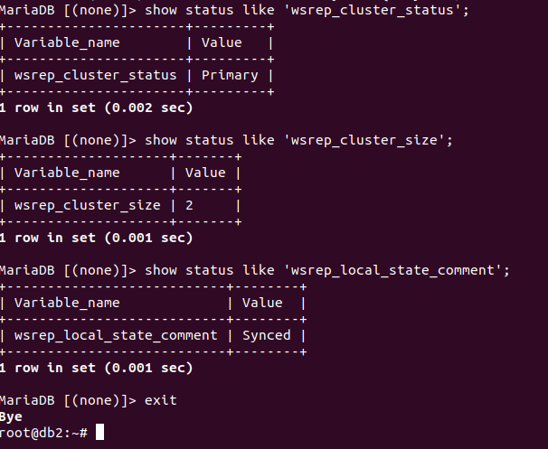

## Данная роль развертывает кластер баз данных galera.

### Проверим статус кластера galera когда все ВМ запущены:

- show status like 'wsrep_cluster_status';
- show status like 'wsrep_cluster_size';
- show status like 'wsrep_local_state_comment';

### Проверим статус кластера galera после жесткого выключения одной ВМ:

- show status like 'wsrep_cluster_status';
- show status like 'wsrep_cluster_size';
- show status like 'wsrep_local_state_comment';

- visit http://demosite.local

- Как мы видим наш сайт доступен. 